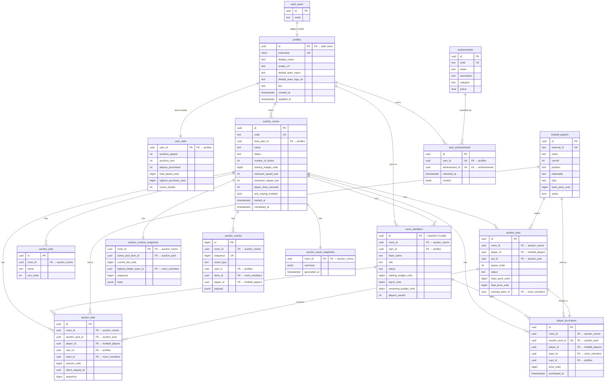

# Database Schema

## ER Diagram

---

## Tables Reference

### `profiles`
One row per auth user. Auto-created by `_internal.handle_new_user()` trigger on `auth.users` INSERT.

| Column | Type | Notes |
|--------|------|-------|
| `id` | `UUID PK` | Mirrors `auth.users.id` |
| `username` | `CITEXT UNIQUE` | 3–30 chars, `[a-zA-Z0-9_]` only |
| `display_name` | `TEXT` | Optional display name |
| `avatar_url` | `TEXT` | |
| `default_team_name` | `TEXT` | Pre-fills room join form |
| `default_team_logo_url` | `TEXT` | |
| `bio` | `TEXT` | |

**Constraints:** `profiles_username_length` (3–30), `profiles_username_format` (alphanumeric + underscore), `profiles_username_unique`

---

### `user_stats`
Auto-created alongside profile. Updated by Fastify via service_role after auction events.

| Column | Type | Notes |
|--------|------|-------|
| `user_id` | `UUID PK/FK` | → profiles |
| `auctions_played` | `INTEGER ≥ 0` | |
| `auctions_won` | `INTEGER ≥ 0` | |
| `players_purchased` | `INTEGER ≥ 0` | |
| `total_spend_units` | `BIGINT ≥ 0` | Half-crore units |
| `highest_purchase_units` | `BIGINT ≥ 0` | Single player max |
| `rooms_hosted` | `INTEGER ≥ 0` | |

---

### `auction_rooms`

| Column | Type | Notes |
|--------|------|-------|
| `id` | `UUID PK` | |
| `code` | `TEXT UNIQUE` | 4–12 chars, join code |
| `host_user_id` | `UUID FK` | → profiles, RESTRICT delete |
| `status` | `TEXT` | `LOBBY \| STARTING \| RUNNING \| PAUSED \| COMPLETED \| CLOSED` |
| `number_of_teams` | `INTEGER > 1` | |
| `starting_budget_units` | `BIGINT > 0` | Half-crore units |
| `maximum_squad_size` | `INTEGER ≥ minimum` | |
| `player_timer_seconds` | `INTEGER > 0` | |
| `anti_sniping_enabled` | `BOOLEAN` | |
| `started_at` | `TIMESTAMPTZ nullable` | Set by Fastify |
| `completed_at` | `TIMESTAMPTZ nullable` | Set by Fastify |

---

### `room_members`
**`id` = `teamId` in Fastify.** Each user can join a room once.

| Column | Type | Notes |
|--------|------|-------|
| `id` | `UUID PK` | Used as `teamId` in Fastify |
| `room_id` | `UUID FK` | CASCADE delete |
| `user_id` | `UUID FK` | RESTRICT delete |
| `role` | `TEXT` | `HOST \| PLAYER` |
| `status` | `TEXT` | `JOINED \| READY \| DISCONNECTED \| LEFT \| KICKED` |
| `starting_budget_units` | `BIGINT > 0` | Copied from room at join |
| `spent_units` | `BIGINT ≥ 0` | Updated by Fastify/persist_sale |
| `remaining_budget_units` | `BIGINT ≥ 0` | Updated by Fastify/persist_sale |
| `players_owned` | `INTEGER ≥ 0` | Updated by persist_sale |

**Unique indexes:** `(room_id, user_id)`, one HOST per room, team name unique per room (case-insensitive).

---

### `football_players`
Master catalogue. Seeded by admin import. Frontend reads; Fastify reads; nobody writes from client.

| Column | Type | Constraint |
|--------|------|------------|
| `overall` | `INTEGER` | 1–99 |
| `position` | `TEXT` | Enum: GK, CB, LB, RB, LWB, RWB, CDM, CM, CAM, LM, RM, LW, RW, CF, ST |
| `pace/shooting/passing/dribbling/defending/physical` | `INTEGER nullable` | 0–99 |
| `base_price_units` | `BIGINT ≥ 0` | Default 2 (= ₹1 Cr) |
| `preferred_foot` | `TEXT nullable` | Left, Right, Both |

---

### `auction_pots`
Room-scoped player groupings (Elite, Attackers, etc.). Fully custom.

---

### `auction_pool`
Players queued for a specific room's auction. One player per room.

| Column | Notes |
|--------|-------|
| `status` | `WAITING → ACTIVE → SOLD / UNSOLD / SKIPPED` |
| `winning_team_id` | → `room_members.id`; set by `persist_sale()` |
| `final_price_units` | Set by `persist_sale()` |

**Unique indexes:** `(room_id, player_id)`, one ACTIVE per room at a time.

---

### `auction_runtime_snapshots`
One row per room. Written by Fastify for crash recovery. **No client access.**

---

### `auction_bids`
Written by Fastify only. Idempotency via `(room_id, user_id, client_request_id)` partial unique index.

---

### `player_purchases`
Canonical ownership record. One per pool item — enforced by `UNIQUE(room_id, auction_pool_id)`. Written by `persist_sale()` only.

---

### `auction_events`
Durable audit log with room-scoped `sequence`. Written by Fastify.

Valid `event_type` values:
`ROOM_CREATED`, `TEAM_JOINED`, `TEAM_LEFT`, `TEAM_KICKED`, `AUCTION_STARTED`, `AUCTION_PAUSED`, `AUCTION_RESUMED`, `AUCTION_COMPLETED`, `PLAYER_STARTED`, `BID_ACCEPTED`, `PLAYER_SOLD`, `PLAYER_UNSOLD`, `PLAYER_SKIPPED`, `ROOM_CLOSED`

---

### `achievements` / `user_achievements`
Seeded achievement catalogue. Fastify inserts into `user_achievements` idempotently — the unique constraint `(user_id, achievement_id)` prevents duplicates.

---

### `auction_result_snapshots`
Immutable JSONB summary written by Fastify on auction completion. Enables fast history rendering.

---

## Views

| View | Purpose |
|------|---------|
| `room_team_summary_v` | Budget + purchase stats per team in a room |
| `room_results_v` | Aggregate stats per room (sold/unsold counts, totals) |
| `user_auction_history_v` | All auctions a user participated in |
| `player_sale_history_v` | Every player sale across all rooms |

All views use `security_invoker = true` — they respect the caller's RLS context.

---

## Foreign Key Delete Behavior

| Parent | Child | On Delete |
|--------|-------|-----------|
| `auth.users` | `profiles` | CASCADE — deletes profile when auth user removed |
| `profiles` | `user_stats` | CASCADE |
| `profiles` | `room_members` | RESTRICT — cannot delete profile while in a room |
| `profiles` | `auction_rooms` (host) | RESTRICT — cannot delete host profile |
| `auction_rooms` | `room_members` | CASCADE |
| `auction_rooms` | `auction_pots` | CASCADE |
| `auction_rooms` | `auction_pool` | CASCADE |
| `auction_rooms` | `auction_runtime_snapshots` | CASCADE |
| `auction_rooms` | `auction_bids` | CASCADE |
| `auction_rooms` | `player_purchases` | CASCADE |
| `auction_rooms` | `auction_events` | CASCADE |
| `auction_rooms` | `auction_result_snapshots` | CASCADE |
| `football_players` | `auction_pool` | RESTRICT — cannot delete a player in a pool |
| `football_players` | `auction_bids` | RESTRICT |
| `football_players` | `player_purchases` | RESTRICT |
| `auction_pool` | `auction_bids` | CASCADE |
| `auction_pool` | `player_purchases` | CASCADE |
| `room_members` | `auction_bids` | RESTRICT |
| `room_members` | `player_purchases` | RESTRICT |
| `auction_pool` winning_team_id | (FK) | SET NULL |
| `room_members` | `auction_runtime_snapshots` | SET NULL |
